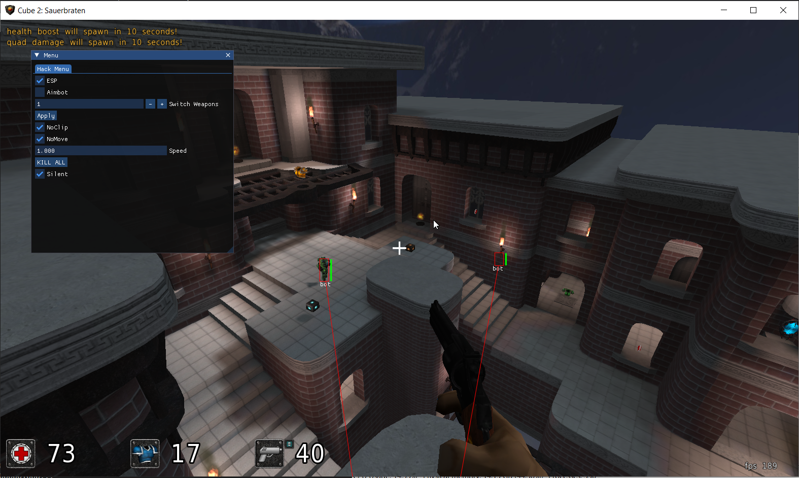
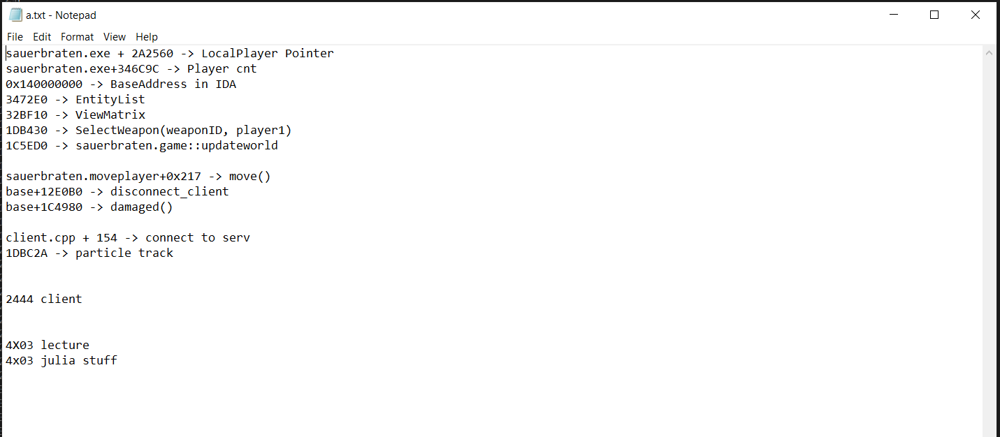
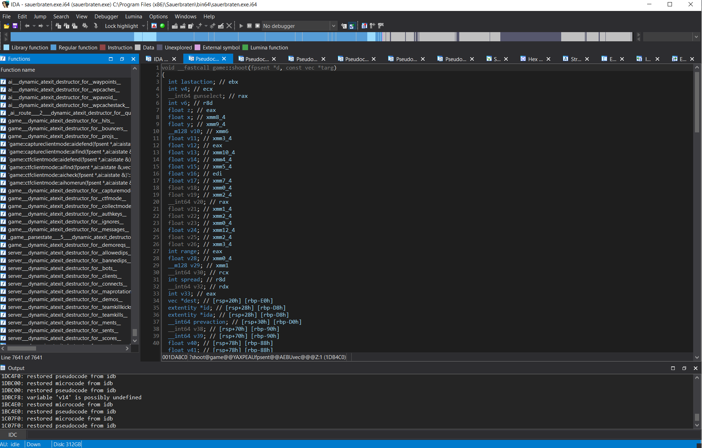

# Sauerbraten-Internal

This is an internal cheat, supported by IDA, to help learn reverse engineering. It uses [Cube 2: Sauerbraten](https://github.com/embeddedc/sauerbraten) as a cross-reference tool for better understanding of functions within the IDA disassembler.

### Features:
*You def can create more amazing features, but I am moving on to my next project...*

ESP  
KILL ALL (works in servers)  
Select Weapon/with ammo  
Slient Aim  
NoClip  
NoMove  

